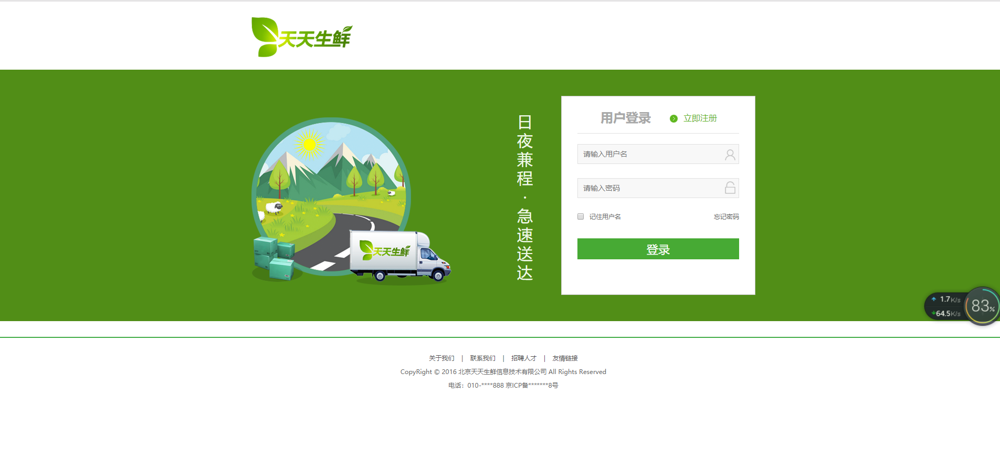
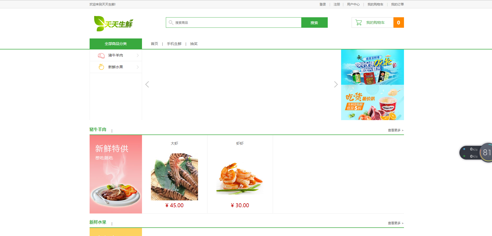
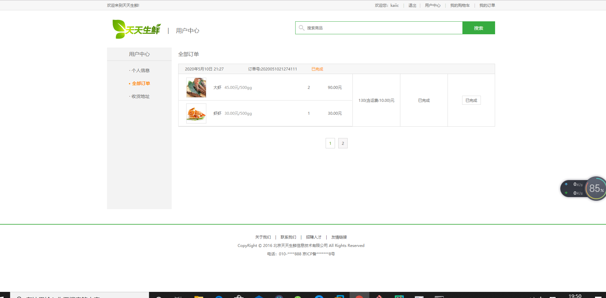

### Dailyfresh

- 天天生鲜商品购物系统：小型电商购物网站
- 项目尽量使用Django内部提供的API，后台管理为Django自带的管理系统django-admin。适合Django的小型实战项目。

#功能简介

- 商品浏览：商品的图片，售价，种类，简介以及库存等信息。
- 全文检索：支持对商品种类以及商品名称，简介的检索。
- 登录注册：用户的登录与注册。
- 用户中心：支持用户个人信息，收货地址等信息的更新，商品加入购物车，订单生成。
- 商品下单：在支付接口和企业资质的支持下可完成商品的下单功能，按照原子事务处理，下单异常则终止此次下单过程。
- 后台管理：支持后台管理功能，商品及用户信息的增加，更新与删除，可自定制样式与功能，日志，以及权限的管理和分配。


### 浏览

##### 首页：



#### 首页：



#### 我的订单：




### 数据库配置
数据库默认使用Django项目生成时自动创建的小型数据库sqlite

也可自行配置连接使用MySQL，redis等
### 创建超级用户
##### 终端下执行:
```python
python manage.py createsuperuser
```
### 开始运行
##### 终端下执行:
```python
python manage.py runserver
```
浏览器打开: http://127.0.0.1/index 即可进入首页
浏览器打开: http://127.0.0.1/admin 即可进入超级用户入口
然后输入相应的超级用户名以及密码，邮箱即可。

#####在虚拟机 服务器端：
启动FAST dfs分布式图片存储服务器：
```python
 在 /etc/fdfs/中终端运行启动tracker和storage：
            sudo service fdfs_trackerd start
            sudo service fdfs_storaged start
```
启动nginx代理服务器，实现反向代理和负载均衡：
```python
启动nginx：
		在 /usr/local/nginx下，终端打开执行 
				sudo sbin/nginx
```
##  感谢：
###### 感谢你的查看！！！
